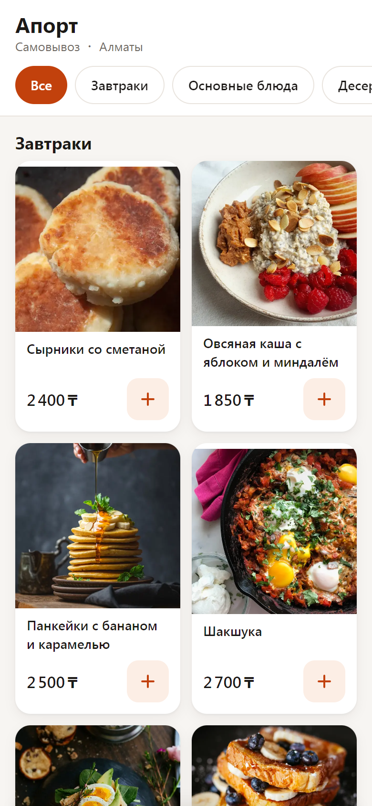
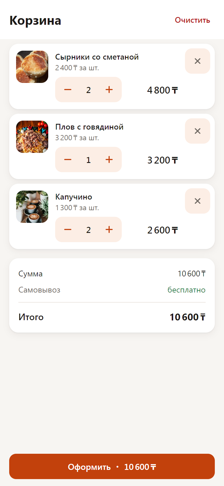
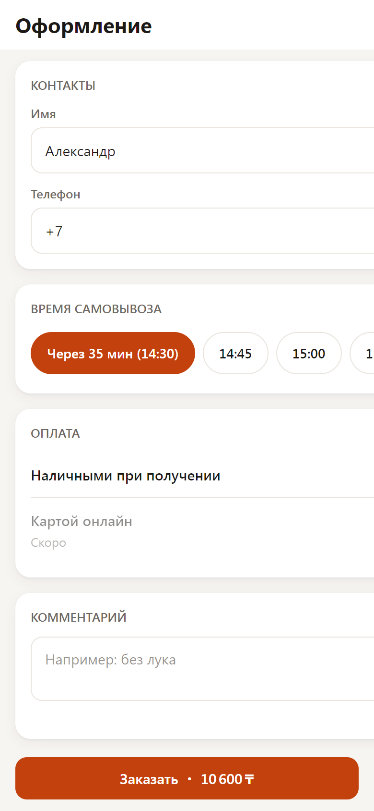
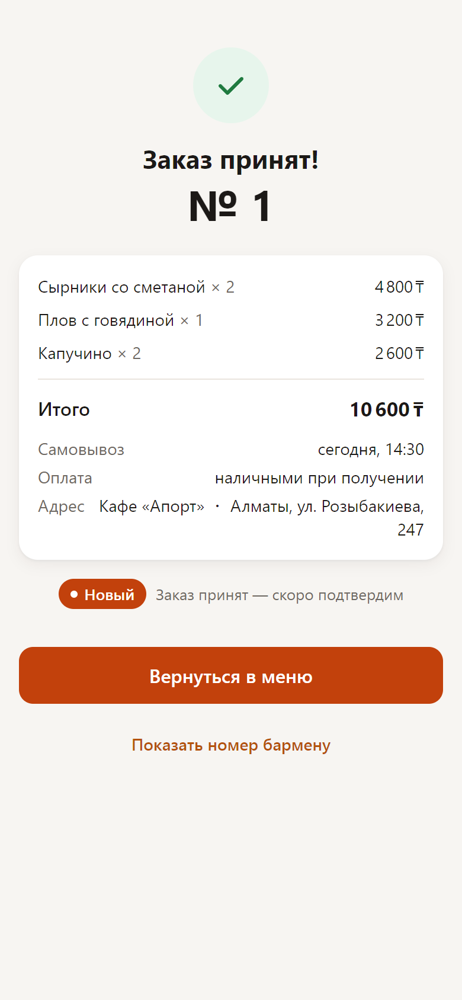
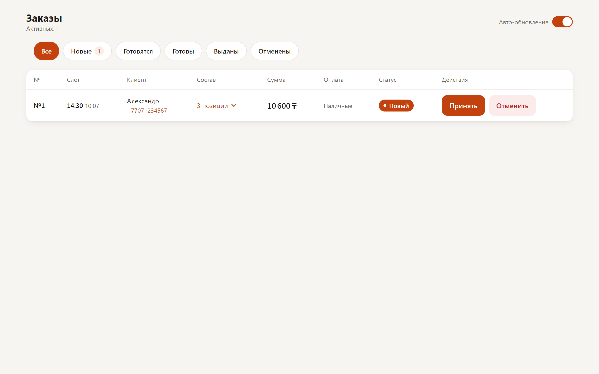

# Апорт — Telegram Mini App для ресторанов

Заказ еды на самовывоз, не выходя из Telegram: каталог меню → корзина → оформление → подтверждение ботом → админ-панель заказов для персонала.

**Live:** [resto-miniapp.vercel.app](https://resto-miniapp.vercel.app) (веб-превью; полный опыт — внутри Telegram)

**Стек:** Next.js 16 (App Router, RSC + Server Actions) · TypeScript strict · Turborepo + pnpm · Tailwind CSS v4 · Prisma 7 + Postgres · Telegram Bot API + Mini Apps · Stripe Checkout · Zod · Vitest · Vercel

<p align="center">
  
</p>

<p align="center">
  
  
  
  
</p>

<p align="center">
  
</p>

## Как это работает

```
Пользователь (Telegram)
   │  открывает Mini App
   ▼
apps/miniapp (Next.js 16, Vercel)
   │  initData ──HMAC──► JWT-сессия (httpOnly cookie)
   │  каталог/корзина/чекаут (RSC + Server Actions)
   │
   ├──► packages/db (Prisma 7 + Postgres/Supabase)
   │      меню, заказы со снапшотами цен, идемпотентность
   │
   ├──► packages/iiko-adapter (интерфейс OrderProvider + mock)
   │      push заказа в POS после коммита транзакции
   │
   └──► Telegram Bot API (webhook, без long-polling)
          чек в чат, статусы «принят» / «готов к выдаче»
```

- **Auth без паролей.** `initData` из Telegram валидируется на сервере ровно один раз (HMAC-SHA256, `timingSafeEqual`, TTL 5 минут) и обменивается на JWT-cookie со sliding-refresh. Каждый Server Action берёт identity из сессии, а не из формы.
- **Ценам клиента не доверяем.** Заказ создаётся в одной транзакции: цены перечитываются из БД по id, позиции снапшотятся (`nameSnapshot`, `priceSnapshot`), сумма сверяется с той, что видел пользователь (`PRICE_CHANGED`, если ресторан успел поднять цены).
- **Идемпотентность на всех границах.** Дабл-сабмит заказа гасится уникальным `idempotencyKey`, повторные доставки Telegram-webhook — таблицей `processed_updates`, Stripe-события — атомарным переходом статуса, гонка лимита активных заказов — serializable-транзакцией.
- **Оплата картой — Stripe Checkout (test mode).** Заказ до оплаты живёт в статусе `PENDING_PAYMENT` и не виден кухне; активацию делает webhook с проверкой подписи по raw-телу и сверкой суммы. Наличные работают без Stripe.
- **Дизайн-система на токенах.** Tailwind v4 CSS-first: палитра, радиусы, тени и типографика объявлены в `@theme`, тёмная тема наследует `themeParams` Telegram. Никаких UI-китов — свои 18 компонентов в `packages/ui`.
- **Все состояния экранов.** Skeleton-лоадеры, пустые состояния, ошибки сети, оффлайн-баннер, haptic feedback через Mini Apps SDK.

## Структура монорепо

```
apps/miniapp        Next.js мини-апп + api-роуты (bot webhook, auth)
packages/ui         Презентационные компоненты (Button, BottomSheet, Stepper…)
packages/db         Prisma-схема, клиент, сид меню
packages/iiko-adapter  Контракт OrderProvider + mock-провайдер
docs/               ADR, спецификация экранов
```

Внутри `apps/miniapp` — Feature-Sliced Design: `shared → entities (menu, cart) → features (checkout, dish-sheet, admin) → widgets (menu-catalog, cart-bar) → app`.

### Про интеграцию с iiko

`packages/iiko-adapter` — это **интерфейс адаптера с mock-провайдером**: реальная интеграция с iikoCloud не подключена (нет доступа к тестовому стенду), но доменный код зависит только от контракта `OrderProvider`, и подключение боевой POS сводится к одной реализации интерфейса. Mock имитирует сетевую задержку и настраиваемую долю сбоев — на нём проверена обработка ошибок.

## Запуск

```bash
pnpm install
cp .env.example apps/miniapp/.env.local   # заполнить значения
pnpm db:generate
pnpm db:seed          # меню: 4 категории, 30 позиций
pnpm dev              # http://localhost:3000
```

Env-переменные — в [.env.example](.env.example): `DATABASE_URL` (Postgres), `BOT_TOKEN` (@BotFather), `TELEGRAM_WEBHOOK_SECRET`, `SESSION_SECRET`, `ADMIN_TG_IDS`.

Webhook бота: `node apps/miniapp/scripts/set-webhook.mjs <app-url>`.

```bash
pnpm test        # 143 unit-теста (Vitest)
pnpm lint && pnpm typecheck && pnpm build
```

## Качество

- CI (GitHub Actions): lint + typecheck + 143 теста + build на каждый push.
- Юнит-тестами покрыта бизнес-логика: HMAC-валидация initData, Zod-схема заказа, слоты самовывоза, карта переходов статусов, корзина, форматирование цен, mock-провайдер POS.
- Adversarial-ревью безопасности в процессе разработки: replay initData, подмена цен, IDOR на заказах, гонки идемпотентности, timing-атаки на сравнение секретов.

---

## English

**Aport** — a Telegram Mini App for restaurant pickup orders: menu catalog → cart → checkout → bot confirmation → staff admin panel.

Built with Next.js 16 (App Router, RSC + Server Actions), TypeScript strict, Turborepo + pnpm workspaces, Tailwind CSS v4 (CSS-first design tokens themed by Telegram's color scheme), Prisma 7 + Postgres, and the Telegram Bot API (webhook-only, no long-polling).

Highlights:

- **Server-side `initData` validation** (HMAC-SHA256, constant-time comparison, 5-minute TTL) exchanged for a JWT session cookie with sliding refresh — no passwords, no client-trusted identity.
- **Orders are created atomically**: prices are re-read from the DB inside a transaction, line items are snapshotted, and the client-visible total is verified (`PRICE_CHANGED` guard). Double submits are neutralized with idempotency keys; webhook redeliveries with a `processed_updates` table.
- **POS integration as an adapter**: `packages/iiko-adapter` ships the `OrderProvider` contract with an honest mock provider (simulated latency and failure rate) — swapping in the real iikoCloud API is a single implementation away.
- **143 unit tests** over the business logic, CI on every push, FSD architecture inside the app, and a hand-rolled 18-component UI kit on design tokens.
